# Dual Email Service Setup Guide

## 🎯 **Overview**

Your system now supports **automatic email failover** from Brevo (primary) to Resend (fallback) for maximum email delivery reliability. This ensures your critical business emails (workflow notifications, deadline reminders, etc.) are delivered even if one service fails.

## ✅ **Current Status**

### **Already Working**
- ✅ **OTP Emails**: Resend primary + Brevo fallback
- ✅ **Resend Integration**: Package installed and configured
- ✅ **Environment Variables**: Both services supported
- ✅ **Webhook Handlers**: Both Brevo and Resend webhooks ready

### **New Enhancement**
- 🆕 **All Email Types**: Workflow notifications, deadline reminders, templates
- 🆕 **Automatic Failover**: Brevo → Resend when Brevo fails
- 🆕 **Comprehensive Logging**: Track which service was used and why
- 🆕 **Service Monitoring**: Real-time status of both email providers

## 🔧 **Environment Configuration**

Add these variables to your `.env.local` file:

```bash
# Brevo Configuration (Primary Service)
BREVO_API_KEY="your-brevo-api-key"
BREVO_SENDER_EMAIL="notifications@cloud9digital.in"
BREVO_SENDER_NAME="Numericalz"
BREVO_REPLY_TO_EMAIL="support@numericalz.com"

# Resend Configuration (Fallback Service)
RESEND_API_KEY="your-resend-api-key"
RESEND_SENDER_EMAIL="noreply@cloud9digital.in"
RESEND_SENDER_NAME="Numericalz"
RESEND_REPLY_TO_EMAIL="support@numericalz.com"

# Webhook Configuration (Optional)
RESEND_WEBHOOK_SECRET="your-resend-webhook-secret"
```

### **Getting Your API Keys**

#### **Brevo (Primary)**
1. Sign up at [Brevo](https://www.brevo.com/)
2. Go to **Account Settings** → **API Keys**
3. Create API key with email sending permissions

#### **Resend (Fallback)**
1. Sign up at [Resend](https://resend.com/)
2. Go to **API Keys**
3. Create new API key
4. Verify your sending domain

## 🚀 **How It Works**

### **Email Flow Priority**

```mermaid
graph TD
    A[Email Request] --> B{Brevo Available?}
    B -->|Yes| C[Send via Brevo]
    B -->|No| D[Send via Resend]
    C --> E{Brevo Success?}
    E -->|Yes| F[✅ Email Sent via Brevo]
    E -->|No| G[⚠️ Try Resend Fallback]
    G --> H{Resend Success?}
    H -->|Yes| I[✅ Email Sent via Resend]
    H -->|No| J[❌ Both Services Failed]
    D --> K{Resend Success?}
    K -->|Yes| L[✅ Email Sent via Resend Only]
    K -->|No| M[❌ No Service Available]
```



### **Automatic Failover Scenarios**

| Scenario | Primary (Brevo) | Fallback (Resend) | Result |
|----------|-----------------|-------------------|---------|
| **Normal Operation** | ✅ Available | ✅ Available | Uses Brevo |
| **Brevo Rate Limited** | ❌ Rate limit | ✅ Available | Auto-switches to Resend |
| **Brevo API Down** | ❌ Service down | ✅ Available | Auto-switches to Resend |
| **Brevo Invalid Key** | ❌ Auth failed | ✅ Available | Auto-switches to Resend |
| **Network Issues** | ❌ Timeout | ✅ Available | Auto-switches to Resend |
| **Both Services Down** | ❌ Failed | ❌ Failed | Email logged as failed |

## 📊 **Enhanced Email Logging**

Your email logs now include detailed failover information:

### **Email Log Fields**
| Field | Description | Example |
|-------|-------------|---------|
| **Service Used** | Which service delivered the email | `"brevo"` or `"resend"` |
| **Failover Used** | Whether fallback was triggered | `true` or `false` |
| **Delivery Time** | Time from send to delivery | `"2.3s"` |
| **Error Details** | Why primary service failed | `"Rate limit exceeded"` |
| **Webhook Data** | Delivery confirmation details | Status updates |

### **Template Data JSON**
```json
{
  "service": "resend",
  "fallbackUsed": true,
  "brevoError": "Rate limit exceeded",
  "deliveryTime": 1850,
  "webhookReceived": true
}
```

## 🧪 **Testing the Dual Service**

### **1. Test Normal Operation**
```bash
POST /api/email/test-dual-service
{
  "to": "your-email@example.com",
  "testType": "both"
}
```

### **2. Test Failover Simulation**
```bash
POST /api/email/test-dual-service
{
  "to": "your-email@example.com",
  "testType": "failover-simulation"
}
```

### **3. Check Service Status**
```bash
GET /api/email/service-status
```

Expected response:
```json
{
  "brevoAvailable": true,
  "resendAvailable": true,
  "fallbackEnabled": true,
  "recentStats": {
    "totalEmails": 1250,
    "brevoUsed": 1200,
    "resendUsed": 50,
    "failoverRate": "4%"
  }
}
```

## 🔄 **Enabling the Dual Service**

### **Step 1: Update Email Service Import**

Replace the current email service import in your API routes:

```typescript
// OLD: Single service
import { emailService } from '@/lib/email-service'

// NEW: Dual service with failover
import { dualEmailService } from '@/lib/email-service-dual'
```

### **Step 2: Update Service Usage**

The API is identical, but now includes automatic failover:

```typescript
// Same API, enhanced reliability
const result = await dualEmailService.sendEmail({
  to: [{ email: 'client@example.com', name: 'Client Name' }],
  subject: 'Important Notification',
  htmlContent: '<p>Your email content</p>',
  emailType: 'WORKFLOW_NOTIFICATION',
  priority: 'HIGH'
})

// Enhanced result includes service info
console.log(result.service) // 'brevo' or 'resend'
console.log(result.failoverUsed) // true if Resend was used as fallback
```

### **Step 3: Update Workflow Notifications**

```typescript
// Enhanced workflow notifications with failover
const result = await dualEmailService.sendWorkflowNotification({
  clientId: client.id,
  recipientEmail: 'user@example.com',
  recipientName: 'User Name',
  workflowType: 'VAT',
  reviewType: 'APPROVED',
  reviewerName: 'Manager Name',
  workflowDetails: { clientName: 'ABC Company Ltd' }
})
```

### **Step 4: Update Deadline Reminders**

```typescript
// Enhanced deadline reminders with failover
const result = await dualEmailService.sendDeadlineReminder({
  clientId: client.id,
  recipientEmail: 'user@example.com',
  recipientName: 'User Name',
  deadlineType: 'VAT Return',
  dueDate: new Date('2025-02-07'),
  urgencyLevel: 'DUE_SOON',
  clientDetails: { companyName: 'ABC Company Ltd' }
})
```

## 📈 **Monitoring & Analytics**

### **Email Delivery Dashboard**

Visit `/dashboard/communication/history` to see:

- **Service Used**: Brevo (green) or Resend (blue) badges
- **Failover Indicators**: Yellow warning icons when fallback used
- **Delivery Times**: Precise timing from send to delivery
- **Error Details**: Detailed failure reasons if both services fail

### **Service Health Monitoring**

```bash
# Check current service health
GET /api/email/service-status

# Get detailed service statistics
GET /api/email/service-stats

# View recent failover events
GET /api/email/failover-history
```

## 🛡️ **Reliability Features**

### **Automatic Retry Logic**
- **Brevo Failure**: Immediately tries Resend
- **Network Timeout**: 30-second timeout per service
- **Rate Limiting**: Automatic detection and fallback

### **Error Classification**
| Error Type | Action Taken |
|------------|--------------|
| **Rate Limit** | Switch to Resend immediately |
| **Authentication** | Switch to Resend, log config issue |
| **Network Timeout** | Switch to Resend after timeout |
| **Invalid Email** | Fail immediately (don't retry) |
| **Service Down** | Switch to Resend, log outage |

### **Comprehensive Logging**
- **Database Logs**: Every email attempt logged
- **Console Logs**: Real-time service status
- **Webhook Updates**: Delivery confirmations
- **Error Tracking**: Detailed failure analysis

## 🔧 **Configuration Flexibility**

### **Service Priority Options**

1. **Brevo Primary (Recommended)**
   ```env
   BREVO_API_KEY="your-key"
   RESEND_API_KEY="your-key"
   ```
   **Result**: Brevo first, Resend fallback

2. **Resend Only**
   ```env
   RESEND_API_KEY="your-key"
   # BREVO_API_KEY not set
   ```
   **Result**: Resend only, no fallback

3. **Brevo Only**
   ```env
   BREVO_API_KEY="your-key"
   # RESEND_API_KEY not set
   ```
   **Result**: Brevo only, no fallback

4. **No Service** (Development)
   ```env
   # Neither key set
   ```
   **Result**: All emails logged but not sent

## 🚨 **Troubleshooting**

### **Common Issues**

#### **Both Services Failing**
1. Check API keys are valid and not expired
2. Verify sender domains are authenticated
3. Check rate limits on both services
4. Review webhook endpoint accessibility

#### **Emails Going to Spam**
1. Set up SPF/DKIM records for both domains
2. Warm up new Resend domain gradually
3. Monitor sender reputation on both services

#### **Failover Not Working**
1. Verify both API keys are configured
2. Check console logs for error details
3. Test individual services separately
4. Review email log database entries

### **Debug Steps**

1. **Test Individual Services**
   ```bash
   POST /api/email/test-dual-service
   {"to": "test@example.com", "testType": "brevo-only"}
   ```

2. **Check Service Status**
   ```bash
   GET /api/email/service-status
   ```

3. **Review Email Logs**
   - Check `/dashboard/communication/history`
   - Look for service indicators and failover flags
   - Review templateData for error details

4. **Monitor Console Logs**
   ```bash
   # Look for these log patterns:
   📧 Attempting to send email via Brevo (primary)...
   ⚠️ Brevo failed, attempting Resend fallback...
   ✅ Email sent successfully via Resend
   ```

## 📚 **Best Practices**

### **Production Deployment**
1. **Test Both Services**: Verify both Brevo and Resend work independently
2. **Monitor Failover Rate**: Should be < 5% under normal conditions
3. **Set Up Alerts**: Monitor for high failover rates
4. **Domain Authentication**: Set up SPF/DKIM for both services
5. **Rate Limit Monitoring**: Track usage on both services

### **Service Management**
1. **Keep Keys Updated**: Rotate API keys regularly
2. **Monitor Quotas**: Track usage limits on both services
3. **Review Analytics**: Check delivery rates and performance
4. **Update Webhooks**: Ensure webhook endpoints are accessible

### **Email Design**
1. **Test Both Services**: Verify templates render correctly
2. **Fallback Content**: Ensure emails work without custom formatting
3. **Mobile Optimization**: Test on various email clients
4. **Accessibility**: Include proper alt text and semantic HTML

## 🎯 **Next Steps**

1. **Enable the Dual Service**: Update your API imports
2. **Test Failover**: Send test emails and verify logs
3. **Monitor Performance**: Watch email delivery metrics
4. **Set Up Webhooks**: Configure delivery status tracking
5. **Review Analytics**: Check failover rates and service health

Your system now has **enterprise-grade email reliability** with automatic failover ensuring critical business communications are always delivered! 