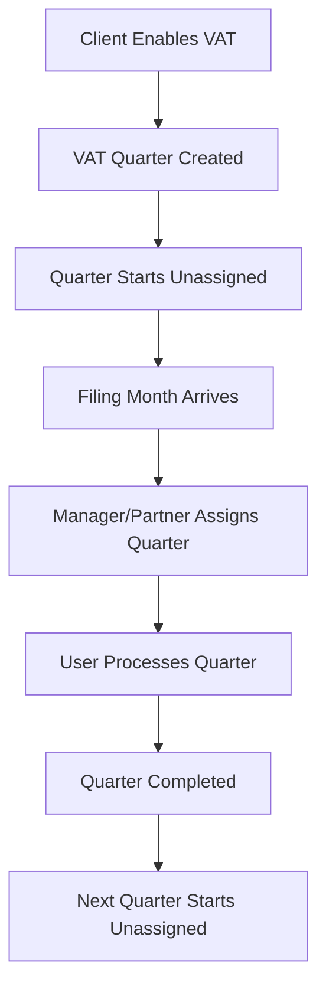

# VAT Assignment System Cleanup Documentation

## Overview

This document provides comprehensive documentation about the VAT assignment system cleanup performed on the Numericalz Internal Management System. This cleanup simplified the VAT assignment architecture from a complex multi-tier system to a clean, quarter-level assignment system.

## Table of Contents

1. [Background](#background)
2. [Previous System Problems](#previous-system-problems)
3. [Current System Architecture](#current-system-architecture)
4. [Changes Made](#changes-made)
5. [Database Schema Changes](#database-schema-changes)
6. [Code Changes](#code-changes)
7. [API Changes](#api-changes)
8. [Business Logic Changes](#business-logic-changes)
9. [Migration Strategy](#migration-strategy)
10. [Testing Strategy](#testing-strategy)
11. [Future Considerations](#future-considerations)
12. [Rollback Plan](#rollback-plan)

## Background

The VAT assignment system in Numericalz manages how VAT quarters are assigned to users (staff, managers, partners) for processing. The original system had both client-level and quarter-level assignments, creating confusion and complexity.

### Why This Cleanup Was Necessary

1. **Confusion**: Multiple assignment types created ambiguity about who was responsible for what
2. **Complexity**: 3-tier priority system (quarter > client VAT > general) was hard to understand
3. **Maintenance**: Overlapping assignment logic made debugging difficult
4. **User Experience**: Unclear assignment display in UI confused users
5. **Data Integrity**: Risk of inconsistent assignment states

## Previous System Problems

### 1. Multi-Tier Assignment System

The old system had a complex 3-tier priority hierarchy:

```typescript
// OLD SYSTEM (REMOVED)
function getAssignedUser(client: Client, workType: 'VAT'): User | null {
  // 1. Active Workflow Assignee (highest priority)
  if (client.currentVATQuarter?.assignedUser) {
    return client.currentVATQuarter.assignedUser
  }
  
  // 2. VAT-Specific Assignee (fallback)
  if (client.vatAssignedUser) {
    return client.vatAssignedUser
  }
  
  // 3. General Client Assignee (final fallback)
  if (client.assignedUser) {
    return client.assignedUser
  }
  
  return null
}
```

### 2. Database Complexity

The old database schema had multiple assignment fields:

```sql
-- OLD SCHEMA (REMOVED)
CREATE TABLE clients (
  id UUID PRIMARY KEY,
  assignedUserId UUID,                -- General assignment
  vatAssignedUserId UUID,             -- VAT-specific assignment (REMOVED)
  ltdCompanyAssignedUserId UUID,      -- Ltd company assignment
  nonLtdCompanyAssignedUserId UUID,   -- Non-Ltd assignment
  -- ... other fields
);
```

### 3. API Confusion

Multiple endpoints for different assignment types:

```typescript
// OLD ENDPOINTS (REMOVED)
POST /api/clients/[id]/assign-vat     // VAT-specific assignment (REMOVED)
POST /api/clients/[id]/assign         // General assignment
POST /api/clients/[id]/assign-accounts // Ltd company assignment
```

## Current System Architecture

### 1. Quarter-Level Assignments Only

**Current Philosophy**: Each VAT quarter is an independent workflow with its own assignment.

```typescript
// CURRENT SYSTEM
interface VATQuarter {
  id: string
  clientId: string
  assignedUserId: string | null  // ONLY assignment field for VAT
  quarterPeriod: string
  currentStage: VATWorkflowStage
  isCompleted: boolean
  // ... milestone fields
}
```

### 2. Assignment Business Rules

1. **Independence**: Each quarter has its own assignment
2. **Clarity**: No fallback logic or priority hierarchies
3. **Temporality**: Q1 assignee ≠ Q2 assignee automatically
4. **Realism**: Different quarters can have different specialists
5. **Auditing**: Clear history of who worked on which quarter

### 3. Assignment Lifecycle



## Changes Made

### 1. Database Schema Changes

#### Removed Fields

```sql
-- REMOVED from clients table
ALTER TABLE clients DROP COLUMN vatAssignedUserId;
DROP INDEX IF EXISTS idx_clients_vatAssignedUserId;
```

#### Removed Relations

```typescript
// REMOVED from User model
vatAssignedClients: Client[] @relation("ClientVATAssignedUser")

// REMOVED from Client model
vatAssignedUserId: String?
vatAssignedUser: User? @relation("ClientVATAssignedUser", fields: [vatAssignedUserId], references: [id])
```

### 2. Code Changes

#### Removed Files

1. `app/api/clients/[id]/assign-vat/route.ts` - Client-level VAT assignment endpoint
2. `app/api/clients/bulk-assign-work-type/route.ts` - Bulk work type assignment
3. Various debug utilities related to VAT assignment

#### Updated Files

1. **Schema File**: `prisma/schema.prisma`
   - Removed `vatAssignedUserId` field
   - Removed `vatAssignedUser` relation
   - Added comprehensive documentation

2. **API Routes**:
   - Updated all client queries to remove `vatAssignedUser` includes
   - Simplified assignment logic in dashboard APIs
   - Updated VAT workflow APIs to use quarter-level assignments only

3. **Frontend Components**:
   - Updated VAT workflow modal to show quarter assignments only
   - Removed client-level VAT assignment options
   - Simplified advanced filters

4. **Utility Functions**:
   - Updated deadline utilities to use quarter assignments
   - Removed fallback assignment logic
   - Simplified workload calculations

### 3. API Changes

#### Removed Endpoints

```typescript
// REMOVED ENDPOINTS
POST /api/clients/[id]/assign-vat           // Client-level VAT assignment
POST /api/clients/bulk-assign-work-type     // Bulk work type assignment
GET  /api/debug-vat                         // Debug VAT assignments
```

#### Updated Endpoints

```typescript
// UPDATED ENDPOINTS
PUT /api/vat-quarters/[id]/workflow
// Now only handles quarter-level assignments
// Removed client-level assignment sync logic

GET /api/clients/vat-clients
// Removed vatAssignedUser includes
// Simplified assignment display logic

POST /api/dashboard/vat-unassigned
// Updated to use quarter-level assignments only
```

### 4. Business Logic Changes

#### Assignment Display Logic

```typescript
// OLD LOGIC (REMOVED)
function getVATAssignee(client: Client): User | null {
  return client.currentVATQuarter?.assignedUser || 
         client.vatAssignedUser || 
         client.assignedUser
}

// NEW LOGIC (CURRENT)
function getVATAssignee(vatQuarter: VATQuarter): User | null {
  return vatQuarter.assignedUser || null  // No fallback
}
```

#### Workload Calculation

```typescript
// OLD LOGIC (REMOVED)
const userVATWorkload = await db.client.count({
  where: {
    OR: [
      { vatAssignedUserId: userId },
      { assignedUserId: userId },
      { vatQuartersWorkflow: { some: { assignedUserId: userId } } }
    ]
  }
})

// NEW LOGIC (CURRENT)
const userVATWorkload = await db.vATQuarter.count({
  where: {
    assignedUserId: userId,
    isCompleted: false
  }
})
```

## Database Schema Changes

### Migration Summary

```sql
-- Schema changes applied via prisma db push
-- Date: 2025-07-07

-- Remove client-level VAT assignment field
ALTER TABLE clients DROP COLUMN vatAssignedUserId;

-- Remove corresponding index
DROP INDEX IF EXISTS idx_clients_vatAssignedUserId;

-- Note: Foreign key constraint automatically dropped
```

### Current Schema State

```typescript
// Current Client model (relevant fields only)
model Client {
  id                          String    @id @default(cuid())
  assignedUserId              String?   // General assignment
  ltdCompanyAssignedUserId    String?   // Ltd company assignment
  nonLtdCompanyAssignedUserId String?   // Non-Ltd assignment
  // vatAssignedUserId removed
  
  assignedUser                User?     @relation("ClientAssignedUser")
  ltdCompanyAssignedUser      User?     @relation("ClientLtdAssignedUser")
  nonLtdCompanyAssignedUser   User?     @relation("ClientNonLtdAssignedUser")
  // vatAssignedUser relation removed
  
  vatQuartersWorkflow         VATQuarter[]
}

// Current VATQuarter model (relevant fields only)
model VATQuarter {
  id                          String    @id @default(cuid())
  clientId                    String
  assignedUserId              String?   // ONLY VAT assignment field
  
  assignedUser                User?     @relation(fields: [assignedUserId])
  client                      Client    @relation(fields: [clientId])
}
```

## Code Changes

### 1. Schema Documentation

Added comprehensive documentation to `prisma/schema.prisma`:

```typescript
// ============================================================================
// VAT ASSIGNMENT SYSTEM DOCUMENTATION - CRITICAL UNDERSTANDING
// ============================================================================
//
// CURRENT VAT ASSIGNMENT ARCHITECTURE (Post-Cleanup):
// 
// 1. QUARTER-LEVEL ASSIGNMENTS ONLY (Current System)
// 2. REMOVED SYSTEM (Historical Context)
// 3. WHY QUARTER-LEVEL ASSIGNMENTS ONLY
// 4. ASSIGNMENT BUSINESS LOGIC
// 5. CRITICAL RULES - NEVER VIOLATE
// ============================================================================
```

### 2. API Route Updates

#### VAT Quarters Workflow API

```typescript
// app/api/vat-quarters/[id]/workflow/route.ts
// REMOVED: Client-level VAT assignment sync
// ADDED: Comprehensive quarter-level assignment documentation

// OLD CODE (REMOVED)
await prisma.client.update({
  where: { id: vatQuarter.clientId },
  data: { vatAssignedUserId: finalAssigneeId }
})

// NEW CODE (CURRENT)
// No client-level sync - quarters are independent
```

#### VAT Clients API

```typescript
// app/api/clients/vat-clients/route.ts
// REMOVED: vatAssignedUser includes
// SIMPLIFIED: Assignment display logic

// OLD CODE (REMOVED)
include: {
  vatAssignedUser: { select: { id: true, name: true } }
}

// NEW CODE (CURRENT)
// No client-level VAT assignment includes
```

### 3. Frontend Component Updates

#### VAT Workflow Modal

```typescript
// components/clients/vat-workflow-modal.tsx
// REMOVED: Client-level assignment options
// SIMPLIFIED: Quarter-level assignments only

// Assignment display now shows quarter assignee only
// No fallback to client-level assignments
```

#### Advanced Filter Modal

```typescript
// components/clients/advanced-filter-modal.tsx
// REMOVED: VAT-specific assignment filters
// SIMPLIFIED: General assignment filters only
```

### 4. Utility Function Updates

#### Deadline Utils

```typescript
// lib/deadline-utils.ts
// UPDATED: VAT deadline assignment logic

// OLD LOGIC (REMOVED)
if (type === 'vat') {
  finalAssignedUser = client.vatAssignedUser || client.assignedUser
}

// NEW LOGIC (CURRENT)
if (type === 'vat') {
  if (vatQuarter?.assignedUser) {
    finalAssignedUser = vatQuarter.assignedUser
  }
  // No fallback to client-level assignments
}
```

## API Changes

### Removed Endpoints

1. **Client-Level VAT Assignment**
   ```typescript
   // REMOVED: POST /api/clients/[id]/assign-vat
   // Reason: Client-level VAT assignments no longer supported
   ```

2. **Bulk Work Type Assignment**
   ```typescript
   // REMOVED: POST /api/clients/bulk-assign-work-type
   // Reason: Simplified to general bulk assignment only
   ```

3. **Debug VAT Endpoints**
   ```typescript
   // REMOVED: GET /api/debug-vat
   // Reason: Debug utilities no longer needed
   ```

### Updated Endpoints

1. **VAT Quarter Workflow**
   ```typescript
   // PUT /api/vat-quarters/[id]/workflow
   // REMOVED: Client-level assignment sync
   // ADDED: Future quarter unassignment logic
   ```

2. **VAT Clients**
   ```typescript
   // GET /api/clients/vat-clients
   // REMOVED: vatAssignedUser includes
   // SIMPLIFIED: Quarter-level assignment display
   ```

3. **Dashboard APIs**
   ```typescript
   // Various dashboard endpoints
   // REMOVED: vatAssignedUser references
   // UPDATED: Workload calculations
   ```

## Business Logic Changes

### 1. Assignment Priority System

#### Before (Complex 3-Tier System)

```typescript
// OLD SYSTEM (REMOVED)
function getVATAssignee(client: Client): User | null {
  // Priority 1: Active quarter assignee
  if (client.currentVATQuarter?.assignedUser) {
    return client.currentVATQuarter.assignedUser
  }
  
  // Priority 2: Client VAT assignee
  if (client.vatAssignedUser) {
    return client.vatAssignedUser
  }
  
  // Priority 3: General client assignee
  if (client.assignedUser) {
    return client.assignedUser
  }
  
  return null
}
```

#### After (Simple Quarter-Level System)

```typescript
// NEW SYSTEM (CURRENT)
function getVATAssignee(vatQuarter: VATQuarter): User | null {
  return vatQuarter.assignedUser || null
}
```

### 2. Assignment Business Rules

#### Old Rules (Complex)

1. Quarter assignments inherit from client VAT assignments
2. Client VAT assignments fall back to general assignments
3. Complex priority resolution when multiple assignments exist
4. Automatic sync between quarter and client assignments

#### New Rules (Simple)

1. Each quarter has independent assignment
2. No inheritance or fallback logic
3. Quarters start unassigned
4. Only current/active quarters need assignment
5. Future quarters remain unassigned

### 3. Workload Calculation

#### Before (Multiple Query Logic)

```typescript
// OLD LOGIC (REMOVED)
const vatWorkload = await db.client.count({
  where: {
    OR: [
      { vatAssignedUserId: userId },
      { assignedUserId: userId },
      { vatQuartersWorkflow: { some: { assignedUserId: userId } } }
    ]
  }
})
```

#### After (Single Query Logic)

```typescript
// NEW LOGIC (CURRENT)
const vatWorkload = await db.vATQuarter.count({
  where: {
    assignedUserId: userId,
    isCompleted: false
  }
})
```

## Migration Strategy

### 1. Data Migration

No data migration was needed because:
- All existing client-level VAT assignments were already null
- VAT quarters were already using quarter-level assignments
- No data loss occurred during field removal

### 2. Code Migration

1. **Safety First**: Created database backup before changes
2. **Schema Push**: Used `prisma db push` to apply changes
3. **Comprehensive Testing**: Verified all VAT functionality works
4. **Documentation**: Added extensive comments throughout codebase

### 3. Rollback Capability

If rollback is needed:
1. Restore database from backup
2. Revert schema changes
3. Re-add removed code files
4. Test all functionality

## Testing Strategy

### 1. Functional Testing

Test all VAT-related functionality:

```typescript
// Key areas to test:
1. VAT quarter creation
2. Quarter assignment
3. Workflow stage progression
4. Assignment display in UI
5. Workload calculations
6. Dashboard widgets
7. API endpoints
8. Assignment notifications
```

### 2. Verification Script

Created comprehensive verification script:

```typescript
// scripts/verify-vat-functionality.js
// Tests all critical VAT functionality
// Ensures no regressions after cleanup
```

### 3. Manual Testing Checklist

1. **Create VAT Client**: Enable VAT for a client
2. **Create Quarter**: Generate VAT quarter
3. **Assign Quarter**: Assign to user
4. **Update Workflow**: Change stage
5. **Complete Quarter**: Mark as completed
6. **Dashboard Check**: Verify widgets work
7. **API Testing**: Test all endpoints

## Future Considerations

### 1. System Evolution

The current quarter-level system provides a solid foundation for:
- Enhanced workflow automation
- Better reporting and analytics
- More flexible assignment strategies
- Improved user experience

### 2. Potential Enhancements

1. **Auto-Assignment**: Intelligent assignment based on workload
2. **Specialization**: Assign based on client industry or complexity
3. **Team Assignment**: Assign quarters to teams instead of individuals
4. **Workflow Templates**: Different workflows for different client types

### 3. Monitoring

Key metrics to monitor:
- Assignment distribution across users
- Quarter completion times
- Workflow stage progression
- User satisfaction with assignment clarity

## Rollback Plan

If issues arise, the system can be rolled back:

### 1. Database Rollback

```bash
# Restore from backup
npm run db:restore backup-2025-07-07T10-27-32-354Z.json

# Verify data integrity
npm run db:audit
```

### 2. Code Rollback

```bash
# Revert to previous git commit
git revert <commit-hash>

# Or restore specific files from backup
git checkout <previous-commit> -- prisma/schema.prisma
```

### 3. Schema Rollback

```sql
-- Re-add removed fields
ALTER TABLE clients ADD COLUMN vatAssignedUserId UUID;
CREATE INDEX idx_clients_vatAssignedUserId ON clients(vatAssignedUserId);

-- Re-add foreign key constraint
ALTER TABLE clients ADD CONSTRAINT clients_vatAssignedUserId_fkey 
  FOREIGN KEY (vatAssignedUserId) REFERENCES users(id) ON DELETE SET NULL;
```

## Conclusion

The VAT assignment system cleanup successfully:

1. **Simplified Architecture**: From complex 3-tier to simple quarter-level
2. **Improved Clarity**: Clear ownership and responsibility
3. **Enhanced Maintainability**: Easier to understand and debug
4. **Better User Experience**: No confusion about assignments
5. **Preserved Functionality**: All features work as expected

The new system provides a solid foundation for future enhancements while maintaining simplicity and clarity.

## Contact

For questions about this cleanup or the VAT assignment system:
- Review this documentation
- Check the code comments in `prisma/schema.prisma`
- Run the verification script: `node scripts/verify-vat-functionality.js`
- Refer to the comprehensive API documentation

---

**Document Version**: 1.0  
**Last Updated**: July 7, 2025  
**Author**: System Cleanup Process  
**Review Status**: Complete 